## Overview

Fish-spots is a website where new and old fishermen can check if their fish spot is visitable.

 

Fishermen can also upload their landscapes of their loved fishing spots and share it with everyone.

 

You will find the weather information about the current day and the next 4 days. The information shown is [degrees, feels like, wind direction and wind speed].

 

You can view all the provided fishing spots for the north and south regions.There is google maps link with short text description about the fish spot.

 

## Details
**Frontend**
- **Stack**: React, Tailwind CSS.
- **Description**: The frontend is entirely built with React. It uses Tailwind CSS to efficiently set styles.

**Backend**
- **Stack**: Django-rest
- **Third-Party-Packages**: Celery, Simple JWT
- **Description**: Using celery to create tasks which are executed every 3 hours to update the database with the new weather data and then cache it. Added simple login/register system.

**Databases**
- **Redis**: Redis is used to store the tasks that are going to be executed.
- **Postgre**: Storing the user data and weather data.

# The sweet part:
- **Here are some images of the home page. 50% zoom**
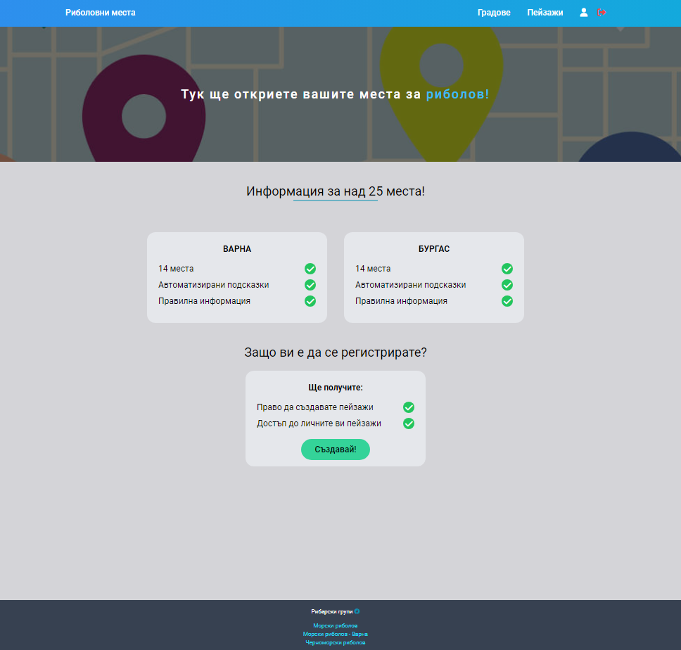

- **Images of city page.**
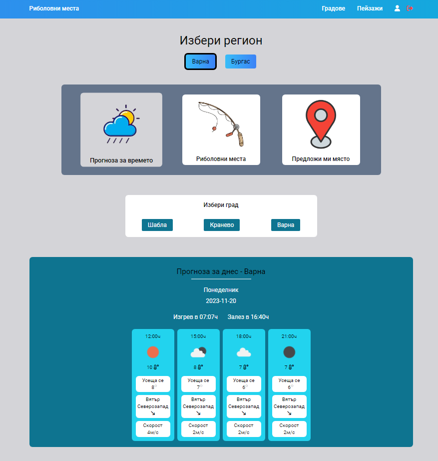
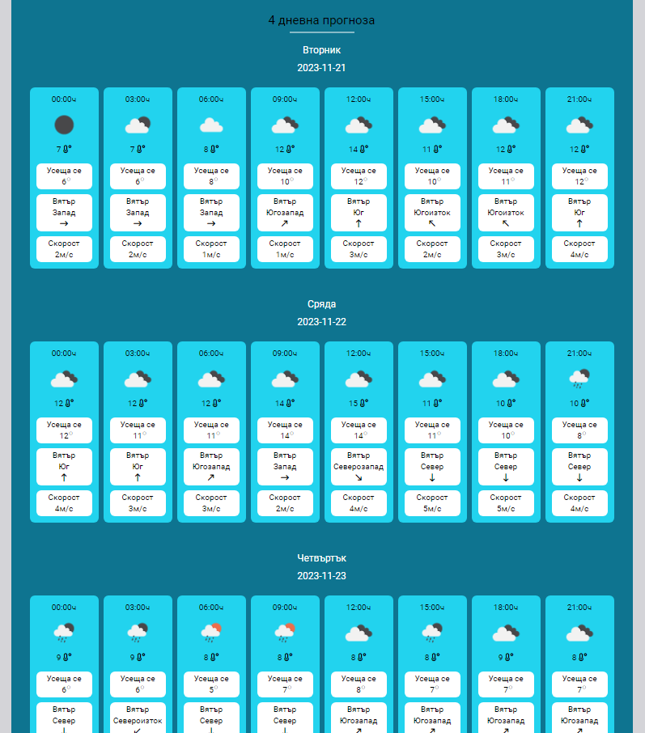
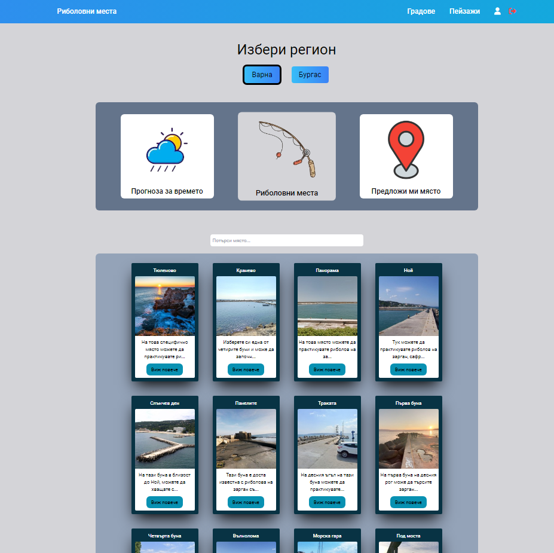
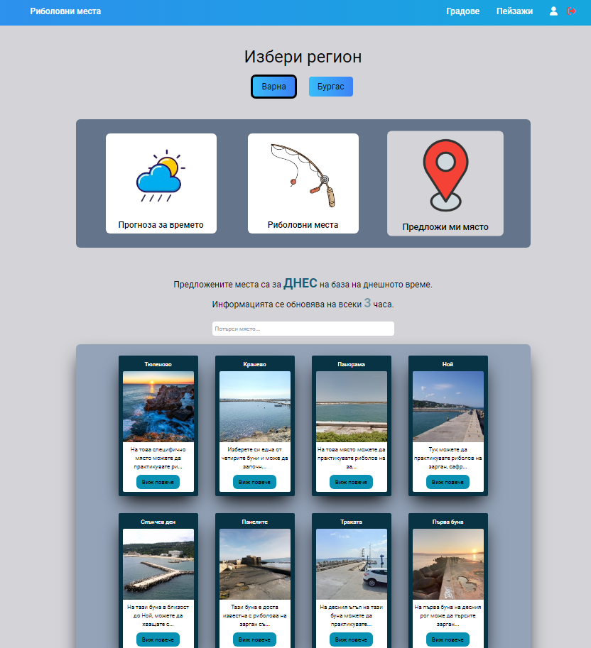

- **Landscape page.**
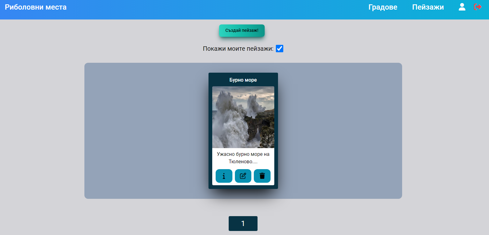
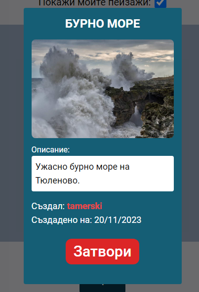
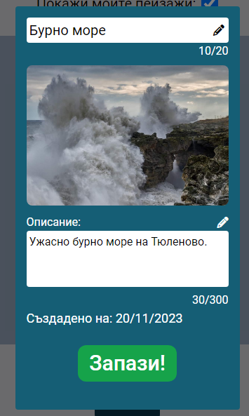
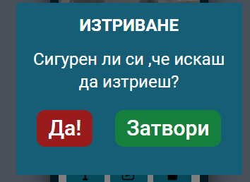

- **Form to create a landscape**
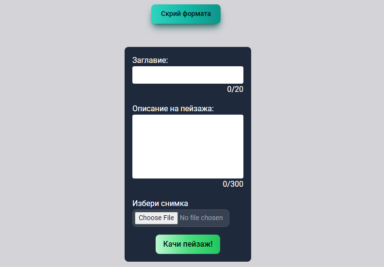

- **User profile management**
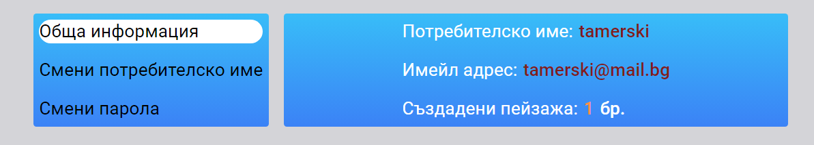
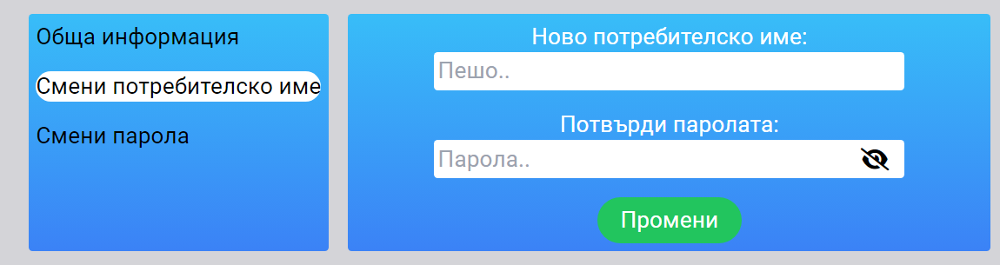
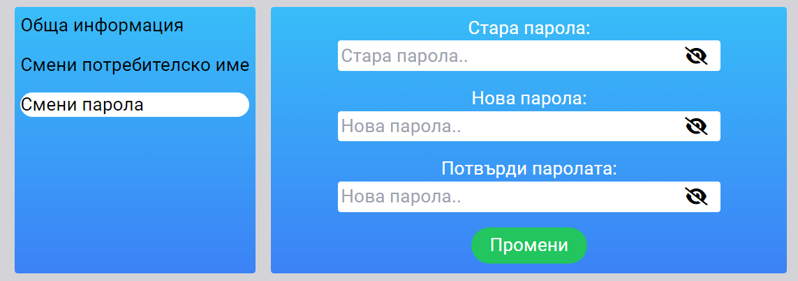

- **Viewing the same user, but with another account logged in**
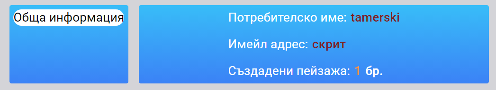

- **Login form**
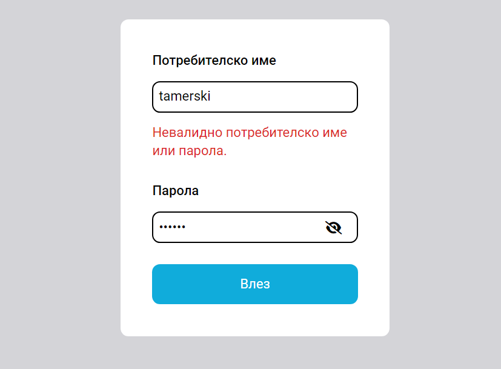

- **Registration form**
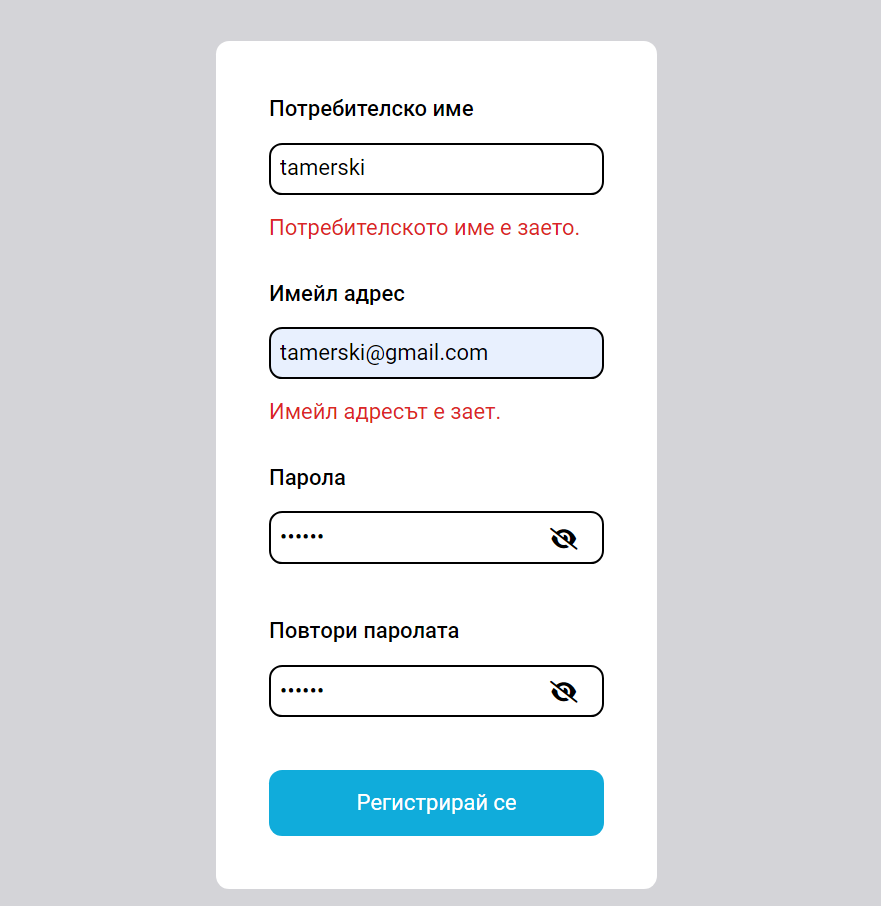

- **404 page**
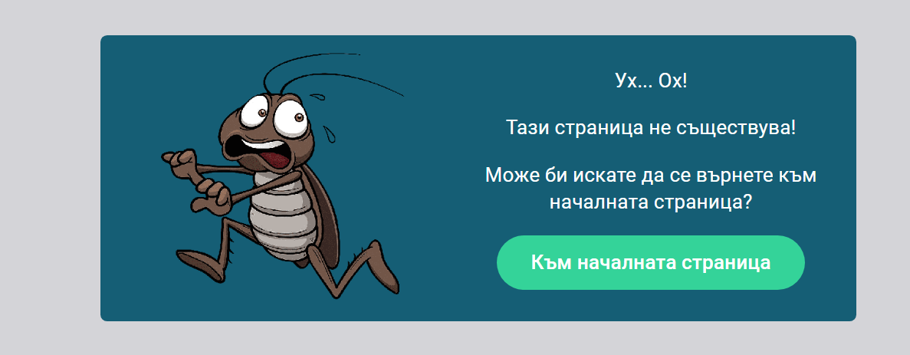